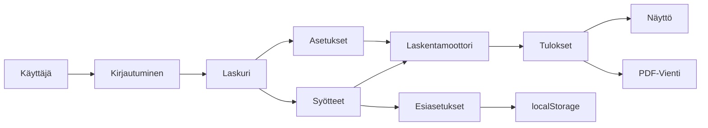
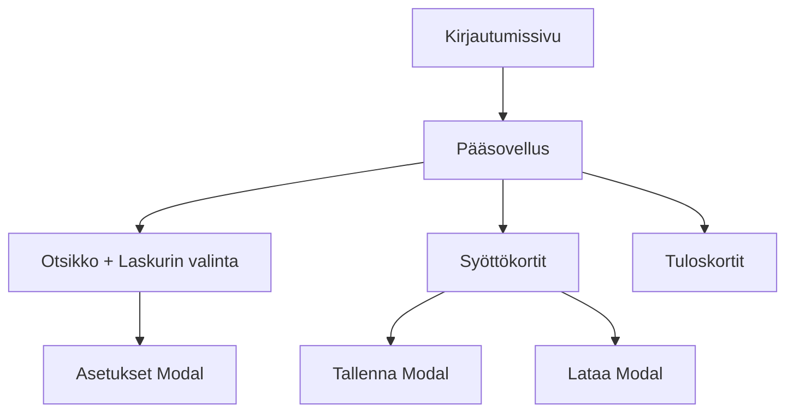
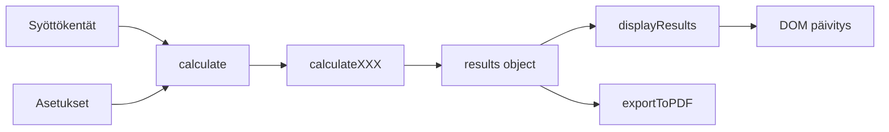

# Harrin Teräsovi Mittalaskuri - Sovelluksen Dokumentaatio

## 1. Sovelluksen Yleiskuvaus

### Tarkoitus
Harrin Teräsovi Mittalaskuri on web-pohjainen sovellus, joka laskee teräsovien komponenttien leikkausmitat syötettyjen ovimittojen perusteella. Sovellus on suunniteltu teräsovien valmistuksessa ja suunnittelussa käytettäväksi työkaluksi.

### Käyttötapaus
Käyttäjä syöttää oven mitat (leveys, korkeus, potkupellin korkeus), ja sovellus laskee automaattisesti seuraavien komponenttien tarkat leikkausmitat:
- Lasilistat (pysty- ja vaakalistat)
- Uretaanipalat (eristysmateriaalit)
- Potkupellit (sisä- ja ulkopuoli)
- Harjalistat (tiivisteet)

### Arkkitehtuuri
Sovellus on toteutettu puhtaalla frontend-teknologialla ilman palvelinriippuvuuksia:

```
Teknologiapino:
├── HTML5 (index.html) - Rakenne ja käyttöliittymä
├── CSS3 (styles.css) - Tyylit ja responsiivisuus
├── JavaScript (app.js) - Sovelluslogiikka
├── Bootstrap 5.3.0 - UI-komponentit
└── jsPDF 2.5.1 - PDF-generointi
```

### Arkkitehtuurikaavio



---

## 2. Salasanasuojaus

### Hyväksytyt Salasanat
Sovellus vaatii kirjautumisen ennen käyttöä. Hyväksytyt salasanat on kovakoodattu:
- `Soma<3`
- `Harri10K`

Salasanat ovat **case-sensitive** (isot/pienet kirjaimet merkitsevät).

### Kirjautumislogiikka

**Toimintaperiaate:**
1. Käyttäjä syöttää salasanan kirjautumissivulla
2. Sovellus vertaa syötettyä salasanaa `VALID_PASSWORDS` -taulukkoon
3. Oikea salasana → Siirrytään laskurisivulle, valitaan oletuksena "Janisol Pariovi"
4. Väärä salasana → Näytetään virheviesti "Väärä salasana. Yritä uudelleen."

**Koodi (app.js, rivit 9-28):**
```javascript
const VALID_PASSWORDS = ['Soma<3', 'Harri10K'];

document.getElementById('loginForm').addEventListener('submit', function(e) {
    e.preventDefault();
    const password = document.getElementById('password').value;
    const errorDiv = document.getElementById('loginError');
    
    if (VALID_PASSWORDS.includes(password)) {
        // Onnistunut kirjautuminen
        document.getElementById('loginScreen').classList.add('d-none');
        document.getElementById('calculatorScreen').classList.remove('d-none');
        selectCalculator('janisol-pariovi');
    } else {
        // Virheellinen salasana
        errorDiv.textContent = 'Väärä salasana. Yritä uudelleen.';
        errorDiv.classList.add('show');
    }
});
```

---

## 3. Neljä Laskurityyppiä

Sovellus sisältää neljä eri laskuria, jotka eroavat toisistaan laskentakaavojen osalta:

| Laskuri | Tyyppi | Näkyykö Lisäovi | Lasilistakaava | Uretaanikaava |
|---------|--------|-----------------|----------------|---------------|
| **Janisol Pariovi** | Pariovi | Kyllä | Janisol | Janisol |
| **Janisol Käyntiovi** | Yksittäisovi | Ei | Janisol | Janisol |
| **Economy Pariovi** | Pariovi | Kyllä | Economy | Economy |
| **Economy Käyntiovi** | Yksittäisovi | Ei | Economy | Economy |

### Laskurin Valinta
- Valinta tapahtuu ylärivin nappirykellä
- Aktiivinen laskuri näkyy violetilla gradienttitaustalla
- Vaihdettaessa laskuria, asetukset palautuvat oletusarvoihin (8mm rako, 1 ruutu)

---

## 4. Laskentakaavat Yksityiskohtaisesti

### 4.1 Lasilista-laskenta

Jokaisessa ruudussa on **aina**:
- 2 pystylistaa
- 2 vaakalistaa

#### Janisol-kaavat
```
Pystylista = Ruudun korkeus + 41 mm
Vaakalista = Oven leveys + 3 mm
```

#### Economy-kaavat
```
Pystylista = Ruudun korkeus + 38 mm
Vaakalista = Oven leveys - 2 mm
```

#### Pariovi-erityispiirteet
Pariovissa lasketaan listat **erikseen molemmille oville**:
- Käyntioven pystylistat: 2 kpl per ruutu
- Lisäoven pystylistat: 2 kpl per ruutu
- Käyntioven vaakalistat: 2 kpl per ruutu (käyntioven leveys)
- Lisäoven vaakalistat: 2 kpl per ruutu (lisäoven leveys)

**Esimerkki:** 1 ruutu, Janisol Pariovi, käyntiovi 795mm, lisäovi 625mm, ruutu 800mm
```
Pystylistat:
- 841 (800+41) x 4 kpl (2 käyntiovi + 2 lisäovi)

Vaakalistat:
- 798 (795+3) x 2 kpl (käyntiovi)
- 628 (625+3) x 2 kpl (lisäovi)
```

### 4.2 Uretaanipalat

Uretaanipalat ovat eristysosia, jotka lasketaan potkupellin korkeuden perusteella.

#### Janisol-kaava
```
Korkeus = Potkupellin korkeus - 126 mm
Leveys = Oven leveys + 46 mm
```

#### Economy-kaava
```
Korkeus = Potkupellin korkeus - 121 mm
Leveys = Oven leveys + 41 mm
```

#### Pariovi
Lasketaan erikseen molemmille oville:
- 1 kpl käyntioven mittojen mukaan
- 1 kpl lisäoven mittojen mukaan

**Tulos muodossa:** `Korkeus x Leveys` (esim. "174 x 841")

### 4.3 Potkupellit

Potkupellit lasketaan erikseen sisä- ja ulkopuolelle. Laskentaan vaikuttaa:
- Laskurityyppi (Janisol/Economy)
- Ovityyppi (käyntiovi/lisäovi)
- Rako-asetus (8mm/10mm/15mm)
- Potkupellin korkeus

#### 4.3.1 Janisol Potkupellit

**Käyntiovi - Sisäpuoli:**
```
Korkeus = Potkupellin korkeus - 67 mm + Rako-korjaus
Leveys = Käyntioven leveys + 115 mm
```

**Käyntiovi - Ulkopuoli:**
```
Korkeus = Potkupellin korkeus - 18 mm + Rako-korjaus
Leveys = Käyntioven leveys + 165 mm
Jos korkeus > 310 mm: Leveys - 5 mm
```

**Lisäovi (Pariovi) - Sisäpuoli:**
```
Korkeus = Potkupellin korkeus - 67 mm + Rako-korjaus
Leveys = Lisäoven leveys + 140 mm
```

**Lisäovi (Pariovi) - Ulkopuoli:**
```
Korkeus = Potkupellin korkeus - 18 mm + Rako-korjaus
Leveys = Lisäoven leveys + 140 mm
Jos korkeus > 310 mm: Leveys - 5 mm
```

#### 4.3.2 Economy Potkupellit

**Käyntiovi - Sisäpuoli:**
```
Korkeus = Potkupellin korkeus - 65 mm + Rako-korjaus
Leveys = Käyntioven leveys + 110 mm
```

**Käyntiovi - Ulkopuoli:**
```
Korkeus = Potkupellin korkeus - 20 mm + Rako-korjaus
Leveys = Käyntioven leveys + 160 mm
Jos korkeus > 310 mm: Leveys - 5 mm
```

**Lisäovi (Pariovi) - Sisäpuoli:**
```
Korkeus = Potkupellin korkeus - 65 mm + Rako-korjaus
Leveys = Lisäoven leveys + 135 mm
```

**Lisäovi (Pariovi) - Ulkopuoli:**
```
Korkeus = Potkupellin korkeus - 20 mm + Rako-korjaus
Leveys = Lisäoven leveys + 135 mm
Jos korkeus > 310 mm: Leveys - 5 mm
```

#### 4.3.3 Rako-korjaukset Potkupelteihin

| Rako-asetus | Sisäpelti korjaus | Ulkopelti korjaus |
|-------------|-------------------|-------------------|
| 8 mm (oletus) | +0 mm | +0 mm |
| 10 mm | +32 mm | +7 mm |
| 15 mm | +27 mm | +2 mm |

**Toteutus koodissa:**
```javascript
let innerHeightAdjust = 0;
let outerHeightAdjust = 0;

if (settings.gapOption === 10) {
    innerHeightAdjust = 32;
    outerHeightAdjust = 7;
} else if (settings.gapOption === 15) {
    innerHeightAdjust = 27;
    outerHeightAdjust = 2;
}
```

### 4.4 Harjalistat

Harjalistat ovat tiivistyslistoja, jotka lasketaan yksinkertaisesti:

```
Harjalista = Oven leveys + 141 mm
```

- **Käyntiovi:** 1 kpl (käyntioven leveys + 141)
- **Pariovi:** 2 kpl (käyntiovi + 141, lisäovi + 141)

**Tulos muodossa:** Pelkkä luku (esim. "936")

### 4.5 Erikoissäännöt

#### Sääntö 1: Ulkopellin leveysvähennys
```
Jos potkupellin ulkopuolen korkeus > 310 mm:
    Ulkopellin leveys - 5 mm
```
Tämä sääntö pätee kaikkiin laskureihin.

#### Sääntö 2: Tulosten yhdistäminen
Identtiset mitat yhdistetään automaattisesti:
- "841, 841, 841, 841" → "841 x 4"
- "798, 798" → "798 x 2"
- Yksittäinen "936" → "936"

#### Sääntö 3: Syötteiden validointi
```
Käyntioven leveys >= 500 mm
Potkupellin korkeus >= 100 mm
Ruudun korkeus >= 100 mm
```

---

## 5. Asetukset

Asetukset avataan "⚙️ Asetukset" -painikkeesta yläoikealla. Asetukset vaikuttavat välittömästi laskentaan.

### 5.1 Rako-vaihtoehdot

| Rako | Sisäpelti + | Ulkopelti + | Käyttötarkoitus |
|------|-------------|-------------|-----------------|
| **8 mm** | +0 mm | +0 mm | Oletusmittaus |
| **10 mm** | +32 mm | +7 mm | Suurempi rako |
| **15 mm** | +27 mm | +2 mm | Erikoistapaukset |

**Vaikutus:**
- Muuttaa vain potkupeltien korkeuksia
- Ei vaikuta lasilistoihin, uretaaniin tai harjalistoihin

### 5.2 Ruutujen Määrä

Valittavissa 1-5 ruutua. Ruutujen määrä vaikuttaa:

#### Syöttökenttiin
- **1 ruutu:** Yksi "Ruudun korkeus" -kenttä
- **2-5 ruutua:** Erilliset kentät "Ruutu 1 korkeus", "Ruutu 2 korkeus", jne.

#### Laskentaan
- Lasilistat lasketaan **jokaiselle ruudulle erikseen**:
  - 2 pystylistaa per ruutu
  - 2 vaakalistaa per ruutu
- Identtiset listat yhdistetään tuloksissa

**Esimerkki:** 3 ruutua, kaikki 800mm korkeita, Janisol
```
Pystylistat: 841 (800+41) x 6 kpl (2 per ruutu × 3 ruutua)
```

#### Pariovissa
Ruutujen määrä koskee **molempia ovia**. Esim. 2 ruutua tarkoittaa:
- 2 ruutua käyntiovessa
- 2 ruutua lisäovessa
- Yhteensä 4 × 2 = 8 pystylistaa

### 5.3 Dynaamiset Syöttökentät

Kun ruutujen määrää muutetaan, sovellus:
1. Tyhjentää `paneHeightInputs` -kontainerin
2. Luo uudet syöttökentät dynaamisesti JavaScript:llä
3. Asettaa oletusarvoksi 800 mm jokaiselle ruudulle
4. Päivittää laskennan automaattisesti

**Toteutus (app.js, rivit 84-145):**
- Yksi ruutu: Kentät sijoitetaan normaaliin grid-rakenteeseen
- Useampi ruutu: Luodaan sisäinen `row` ja jokaiselle ruudulle `col-md-6 col-lg-3`

---

## 6. Esiasetukset (Presets)

Esiasetukset mahdollistavat usein käytettyjen mittayhdistelmien tallentamisen ja lataamisen.

### 6.1 Tallennusmekanismi

**Tallennus localStorage:en:**
```javascript
// Tietorakenne
{
    "Ovi1": {
        calculator: "janisol-pariovi",
        mainDoorWidth: "795",
        sideDoorWidth: "625",
        kickPlateHeight: "300",
        settings: { gapOption: 8, paneCount: 1 },
        paneHeights: ["800"]
    },
    "Ovi2": { ... }
}
```

**Avain:** `doorPresets`
**Muoto:** JSON-merkkijono

### 6.2 Toiminnot

#### Tallennus
1. Käyttäjä painaa "💾 Tallenna"
2. Avautuu modal, jossa kysytään nimeä
3. Syötetään nimi (esim. "Ovi1")
4. Tallennetaan kaikki nykyiset syötteet ja asetukset
5. Näytetään vahvistus "Esiasetus tallennettu!"

**Funktio:** `savePreset()` ja `confirmSavePreset()` (app.js, rivit 519-555)

#### Lataus
1. Käyttäjä painaa "📂 Lataa"
2. Avautuu modal, jossa näkyy lista tallennetuista esiasetuksista
3. Käyttäjä klikkaa haluamansa esiasetuksen nimeä
4. Tarkistetaan, että esiasetus on nykyiselle laskurille
5. Ladataan arvot syöttökenttiin
6. Lasketaan tulokset automaattisesti

**Funktio:** `loadPreset(name)` (app.js, rivit 587-619)

#### Poisto
1. Lataus-modalissa jokaisen esiasetuksen vieressä on 🗑️ -painike
2. Painiketta painettaessa kysytään vahvistus
3. Vahvistuksen jälkeen poistetaan localStorage:sta
4. Päivitetään lista välittömästi

**Funktio:** `deletePreset(name, event)` (app.js, rivit 621-634)

### 6.3 Tietorakenne

```javascript
preset = {
    calculator: string,        // "janisol-pariovi", "janisol-kayntiovi", etc.
    mainDoorWidth: string,     // "795"
    sideDoorWidth: string,     // "625"
    kickPlateHeight: string,   // "300"
    settings: {
        gapOption: number,     // 8, 10, tai 15
        paneCount: number      // 1-5
    },
    paneHeights: string[]      // ["800"] tai ["800", "900", "1000"]
}
```

### 6.4 Validointi

- Jos ladattava esiasetus on eri laskurille, näytetään virheilmoitus
- Tyhjää nimeä ei hyväksytä tallennettaessa
- Poistossa kysytään vahvistus

---

## 7. PDF-Vienti

PDF-vienti mahdollistaa laskentatulosten tallentamisen ja tulostamisen.

### 7.1 Käytetty Kirjasto

**jsPDF 2.5.1**
- CDN: `https://cdnjs.cloudflare.com/ajax/libs/jspdf/2.5.1/jspdf.umd.min.js`
- Käyttö: `const { jsPDF } = window.jspdf;`

### 7.2 PDF:n Sisältö

#### Otsikko
```
Harrin Teräsovi Mittalaskuri
[Laskurin nimi] (esim. "Janisol Pariovi")
```

#### Syötteet
```
Syötteet:
  Käyntioven leveys: 795 mm
  Lisäoven leveys: 625 mm (vain pariovi)
  Potkupellin oletuskorkeus: 300 mm
  Ruutu 1 korkeus: 800 mm
  Ruutu 2 korkeus: 900 mm (jos useita ruutuja)
  ...
  Rako: 8 mm
  Ruutujen määrä: 1
```

#### Tulokset
```
Tulokset:

Lasilista
  841 x 4
  798 x 2
  628 x 2

Uretaani
  174 x 841
  174 x 671

Potkupelti
  233 x 910
  233 x 765
  282 x 960
  282 x 765

Harjalista
  936
  766
```

### 7.3 Muotoilu

- **Fonttikoko:**
  - Pääotsikko: 18pt
  - Alaotsikko: 14pt
  - Leipäteksti: 12pt
  - Tuloslistaukset: 10pt
- **Sijainti:** Vasen marginaali 20-25mm, ylämarginaali 20mm
- **Sivutus:** Automaattinen sivunvaihto kun yPos > 280mm
- **Tiedostonimi:** `[Laskurin nimi]_[Päivämäärä].pdf` (esim. "Janisol_Pariovi_29.12.2025.pdf")

### 7.4 Toteutus

**Funktio:** `exportToPDF()` (app.js, rivit 637-720)

**Kulku:**
1. Luodaan uusi jsPDF-dokumentti
2. Lisätään otsikot
3. Haetaan syötteet lomakekentistä
4. Haetaan tulokset DOM:sta (`.result-section` ja `.result-item`)
5. Muotoillaan ja lisätään PDF:ään
6. Tallennetaan ja käynnistetään lataus

---

## 8. Käyttöliittymän Rakenne

### 8.1 Yhden Sivun Malli

Sovellus toimii **single-page application (SPA)** -periaatteella:



### 8.2 Komponentit ja Sijainti

#### Ylhäältä alas:

**1. Otsikkorivi**
```
[Harrin Teräsovi Mittalaskuri]                    [Kirjaudu ulos]
─────────────────────────────────────────────────────────────────
[Janisol Pariovi] [Janisol Käyntiovi] [Economy Pariovi] [Economy Käyntiovi]  [⚙️ Asetukset]
```

**2. Syöttökortit**
```
┌─────────────────────────────────────────────────────────────┐
│ Syötteet                                                     │
├─────────────────────────────────────────────────────────────┤
│ [Käyntiovi] [Lisäovi] [Potkupelti] [Ruutu 1] [Ruutu 2] ... │
│                                                              │
│ [💾 Tallenna] [📂 Lataa] [📄 Vie PDF:ksi]                   │
└─────────────────────────────────────────────────────────────┘
```

**3. Tuloskortti**
```
┌─────────────────────────────────────────────────────────────┐
│ Tulokset                                                     │
├─────────────────────────────────────────────────────────────┤
│ ┌──────────┐ ┌──────────┐ ┌──────────┐ ┌──────────┐       │
│ │Lasilista │ │ Uretaani │ │Potkupelti│ │Harjalista│       │
│ │          │ │          │ │          │ │          │       │
│ │ 841 x 4  │ │174 x 841 │ │233 x 910 │ │   936    │       │
│ │ 798 x 2  │ │174 x 671 │ │233 x 765 │ │   766    │       │
│ │ 628 x 2  │ └──────────┘ │282 x 960 │ └──────────┘       │
│ └──────────┘              │282 x 765 │                     │
│                           └──────────┘                     │
└─────────────────────────────────────────────────────────────┘
```

### 8.3 Responsiivisuus

#### Desktop (≥992px)
- Laskurinvalinta: 4 nappia vierekkäin
- Syötteet: 4 kenttää vierekkäin
- Tulokset: 4 saraketta vierekkäin

#### Tablet (768px - 991px)
- Laskurinvalinta: 4 nappia vierekkäin (pienemmät)
- Syötteet: 2 kenttää vierekkäin
- Tulokset: 2 saraketta vierekkäin

#### Mobiili (<768px)
- Laskurinvalinta: 2x2 ruudukko
- Syötteet: 1 kenttä per rivi
- Tulokset: 1 sarake per rivi

**Media query (styles.css, rivit 142-163):**
```css
@media (max-width: 768px) {
    .btn-group .btn {
        flex: 1 1 calc(50% - 5px);
        font-size: 0.85rem;
    }
}
```

### 8.4 Värimaailma

| Elementti | Väri | Käyttö |
|-----------|------|--------|
| Tausta | `linear-gradient(135deg, #667eea 0%, #764ba2 100%)` | Sivun tausta |
| Kortit | `#ffffff` | Taustaväri korteille |
| Pää-nappi | `#667eea` → `#764ba2` gradient | Ensisijaiset toiminnot |
| Aktiivinen laskuri | Gradient + font-weight: 600 | Valittu laskuri |
| Tulokset-tausta | `#f8f9fa` | Tuloskontti |
| Otsikot | `#667eea` | Tulosten osiot |

---

## 9. Tiedostorakenne

### 9.1 index.html (193 riviä)

**Rakenne:**
```html
<!DOCTYPE html>
<html lang="fi">
<head>
    - Meta-tagit (UTF-8, viewport)
    - Otsikko
    - Bootstrap 5.3.0 CSS
    - styles.css
</head>
<body>
    <!-- Kirjautumissivu -->
    <div id="loginScreen">
        - Salasanakenttä
        - Kirjaudu-nappi
        - Virheviesti-alue
    </div>
    
    <!-- Laskurisovelllus -->
    <div id="calculatorScreen" class="d-none">
        <!-- Otsikko + Laskurin valinta -->
        <div class="card">
            - Otsikko + Kirjaudu ulos
            - 4 laskurin valintanappia
            - Asetukset-nappi
        </div>
        
        <!-- Syötteet -->
        <div class="card">
            - Käyntioven leveys
            - Lisäoven leveys (piilotettu käyntiovi-laskureissa)
            - Potkupellin korkeus
            - Ruutujen korkeudet (dynaaminen)
            - Tallenna/Lataa/PDF-napit
        </div>
        
        <!-- Tulokset -->
        <div class="card">
            - results-div (täytetään JS:llä)
        </div>
    </div>
    
    <!-- Modalit -->
    - settingsModal (Asetukset)
    - savePresetModal (Tallenna esiasetus)
    - loadPresetModal (Lataa esiasetus)
    
    <!-- Skriptit -->
    - Bootstrap 5.3.0 JS
    - jsPDF 2.5.1
    - app.js
</body>
</html>
```

### 9.2 app.js (721 riviä)

**Funktiorakenne:**

```javascript
// Globaalit muuttujat (rivit 1-9)
- currentCalculator: string
- settings: { gapOption, paneCount }
- VALID_PASSWORDS: array

// Kirjautuminen (rivit 11-38)
- Login event listener
- logout()

// Laskurin valinta (rivit 40-67)
- selectCalculator(type)

// Asetukset (rivit 69-145)
- openSettings()
- applySettings()
- updatePaneInputs()

// Laskenta (rivit 147-182)
- calculate() - Päälaskentafunktio

// Laskentafunktiot (rivit 184-466)
- calculateJanisolPariovi(mainWidth, sideWidth, kickHeight, paneHeights)
- calculateJanisolKayntiovi(mainWidth, kickHeight, paneHeights)
- calculateEconomyPariovi(mainWidth, sideWidth, kickHeight, paneHeights)
- calculateEconomyKayntiovi(mainWidth, kickHeight, paneHeights)

// Tulosten näyttäminen (rivit 468-516)
- displayResults(results)
- combineResults(items)

// Esiasetukset (rivit 518-634)
- savePreset()
- confirmSavePreset()
- loadPresetDialog()
- loadPreset(name)
- deletePreset(name, event)

// PDF-vienti (rivit 636-720)
- exportToPDF()
```

**Datavirta:**



### 9.3 styles.css (184 riviä)

**Rakenne:**

```css
/* Yleiset tyylit (rivit 1-43) */
- body: gradient-tausta
- .card: pyöristetyt kulmat, varjo
- .btn: napit hover-efekteillä
- .form-control: syöttökentät fokus-efekteillä

/* Tulokset (rivit 45-74) */
- .results-container: harmaa tausta, padding
- .result-section: osioiden rakenne
- .result-item: yksittäiset tulosrivit

/* Laskurin valinta (rivit 76-98) */
- .btn-group: napit vierekkäin
- .btn-outline-primary: reunanappi
- .active: aktiivinen tila gradientilla

/* Modalit (rivit 100-140) */
- .modal-content: pyöristetyt
- .modal-header: gradient-tausta
- .list-group-item: esiasetuslistat

/* Responsiivisuus (rivit 142-163) */
- @media (max-width: 768px): mobiilisäädöt

/* Scrollbar (rivit 165-182) */
- Mukautettu scrollbar väreillä
```

---

## 10. Käyttöönotto

### Käynnistys
1. Avaa `index.html` verkkoselaimessa
2. Ei vaadi palvelinta tai asennuksia
3. Toimii offline:na (lukuun ottamatta CDN-kirjastoja)

### Selainvaatimukset
- Chrome 90+
- Firefox 88+
- Safari 14+
- Edge 90+
- localStorage-tuki vaaditaan esiasetuksille

### Tiedostojen sijainti
```
projekti/
├── index.html
├── app.js
├── styles.css
├── README.md
└── plan.md (tämä dokumentti)
```

---

## 11. Laskentaesimerkit

### Esimerkki 1: Janisol Käyntiovi, Perustapaus

**Syötteet:**
- Käyntioven leveys: 795 mm
- Potkupellin korkeus: 300 mm
- Ruudun korkeus: 800 mm
- Rako: 8 mm (oletus)
- Ruutujen määrä: 1

**Laskelmat:**

**Lasilistat:**
```
Pystylistat: 800 + 41 = 841 mm × 2 kpl
Vaakalistat: 795 + 3 = 798 mm × 2 kpl
```

**Uretaani:**
```
Korkeus: 300 - 126 = 174 mm
Leveys: 795 + 46 = 841 mm
→ 174 x 841
```

**Potkupellit:**
```
Sisä: (300 - 67 + 0) x (795 + 115) = 233 x 910
Ulko: (300 - 18 + 0) x (795 + 165) = 282 x 960
      (282 ei > 310, joten ei vähennystä)
```

**Harjalista:**
```
795 + 141 = 936
```

**Tulokset:**
```
Lasilista: 841 x 2, 798 x 2
Uretaani: 174 x 841
Potkupelti: 233 x 910, 282 x 960
Harjalista: 936
```

### Esimerkki 2: Economy Pariovi, Useita Ruutuja

**Syötteet:**
- Käyntioven leveys: 795 mm
- Lisäoven leveys: 625 mm
- Potkupellin korkeus: 300 mm
- Ruutu 1 korkeus: 800 mm
- Ruutu 2 korkeus: 1000 mm
- Rako: 10 mm
- Ruutujen määrä: 2

**Laskelmat:**

**Lasilistat:**
```
Pystylistat käyntiovi:
  Ruutu 1: 800 + 38 = 838 × 2
  Ruutu 2: 1000 + 38 = 1038 × 2

Pystylistat lisäovi:
  Ruutu 1: 800 + 38 = 838 × 2
  Ruutu 2: 1000 + 38 = 1038 × 2

Vaakalistat käyntiovi:
  795 - 2 = 793 × 4 (2 per ruutu × 2 ruutua)

Vaakalistat lisäovi:
  625 - 2 = 623 × 4
```

**Uretaanipalat:**
```
Käyntiovi: (300 - 121) x (795 + 41) = 179 x 836
Lisäovi: (300 - 121) x (625 + 41) = 179 x 666
```

**Potkupellit (10mm rako: sisä +32, ulko +7):**
```
Käyntiovi sisä: (300 - 65 + 32) x (795 + 110) = 267 x 905
Käyntiovi ulko: (300 - 20 + 7) x (795 + 160) = 287 x 955
Lisäovi sisä: (300 - 65 + 32) x (625 + 135) = 267 x 760
Lisäovi ulko: (300 - 20 + 7) x (625 + 135) = 287 x 760
```

**Harjalistat:**
```
Käyntiovi: 795 + 141 = 936
Lisäovi: 625 + 141 = 766
```

**Tulokset (yhdistettynä):**
```
Lasilista: 838 x 4, 1038 x 4, 793 x 4, 623 x 4
Uretaani: 179 x 836, 179 x 666
Potkupelti: 267 x 905, 287 x 955, 267 x 760, 287 x 760
Harjalista: 936, 766
```

### Esimerkki 3: Erikoissääntö - Korkea Potkupelti

**Syötteet:**
- Janisol Käyntiovi
- Käyntioven leveys: 900 mm
- Potkupellin korkeus: 350 mm (korkea!)
- Ruudun korkeus: 800 mm

**Potkupellit:**
```
Ulko: 350 - 18 = 332 mm (> 310 mm!)
Leveys: 900 + 165 = 1065 mm
→ ERIKOISSÄÄNTÖ: 1065 - 5 = 1060 mm

Tulos: 332 x 1060 (ei 332 x 1065)
```

---

## 12. Vianetsintä ja Yleiset Ongelmat

### Ongelma 1: Tulokset eivät päivity
**Syy:** Syöttökenttä on tyhjä tai arvo < minimiarvon  
**Ratkaisu:** Tarkista että käyntioven leveys ≥ 500 mm ja korkeudet ≥ 100 mm

### Ongelma 2: Esiasetuksia ei voi ladata
**Syy:** localStorage ei käytössä tai esiasetus eri laskurille  
**Ratkaisu:** Varmista että valittu oikea laskuri ensin

### Ongelma 3: PDF ei lataudu
**Syy:** jsPDF ei latautunut CDN:stä  
**Ratkaisu:** Tarkista internet-yhteys, tai lataa jsPDF paikallisesti

### Ongelma 4: Lisäoven kenttä ei näy
**Syy:** Valittuna käyntiovi-laskuri  
**Ratkaisu:** Vaihda pariovi-laskuriin

### Ongelma 5: Rako-asetus ei vaikuta
**Syy:** Rako vaikuttaa vain potkupelteihin  
**Ratkaisu:** Tämä on normaalia - tarkista potkupeltien mitat

---

## 13. Tulevat Kehityskohteet

Mahdollisia parannuksia tulevaisuudessa:
- Metrisesta imperiaaliyksikköihin muunnos
- Useampia laskurityyppejä
- Excel-vienti PDF:n lisäksi
- Tulostusystävällinen versio
- Mittahistorian tallennus
- Kuvien lisäys PDF:ään
- Laskennan selitykset (miten luku saatiin)
- Vertailutila (kahden laskelman vertailu)

---

## Yhteenveto

Harrin Teräsovi Mittalaskuri on täysimittainen web-sovellus teräsovien komponenttien laskentaan. Se yhdistää:
- ✅ Intuitiivisen yhden sivun käyttöliittymän
- ✅ Tarkat laskentakaavat neljälle laskurityypille
- ✅ Joustavat asetukset (rako, ruutujen määrä)
- ✅ Esiasetukset usein käytettyjä mittoja varten
- ✅ PDF-viennin ammattimaisia raportteja varten
- ✅ Responsiivisen suunnittelun kaikille laitteille

Sovellus on valmis tuotantokäyttöön ja vaatii vain selaimen toimiakseen.

---

**Dokumentin versio:** 1.0  
**Päivitetty:** 29.12.2025  
**Tekijä:** Cursor AI + Harri

