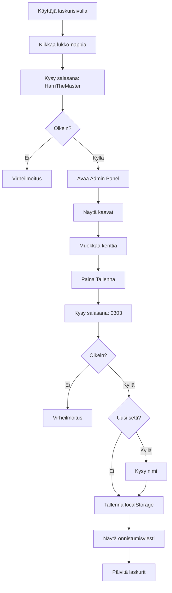

# Admin Panel - Kaavahallinta

## UI Mockup - Admin Panel

```javascript
┌─────────────────────────────────────────────────────────────────┐
│ 🔒 Kaavahallinta                                    [X Sulje]   │
├─────────────────────────────────────────────────────────────────┤
│                                                                  │
│  Aktiivinen kaavasetti: [Default Kaavat ▼]  [+ Uusi kaavasetti]│
│                                                                  │
│  ┌─────────────────────────────────────────────────────────┐   │
│  │ 📊 JANISOL PARIOVI                                      │   │
│  ├─────────────────────────────────────────────────────────┤   │
│  │ Lasilistat:                                             │   │
│  │   Pystylista: [Ruudun korkeus] + [41] mm               │   │
│  │   Vaakalista: [Oven leveys] + [3] mm                   │   │
│  │                                                          │   │
│  │ Uretaanipalat:                                          │   │
│  │   Korkeus: [Potkupellin korkeus] - [126] mm            │   │
│  │   Leveys: [Oven leveys] + [46] mm                      │   │
│  │                                                          │   │
│  │ Potkupellit - Käyntiovi:                               │   │
│  │   Sisä korkeus: [Potkupellin korkeus] - [67] + Rako    │   │
│  │   Sisä leveys: [Oven leveys] + [115] mm                │   │
│  │   Ulko korkeus: [Potkupellin korkeus] - [18] + Rako    │   │
│  │   Ulko leveys: [Oven leveys] + [165] mm (−5 jos >310)  │   │
│  │                                                          │   │
│  │ Potkupellit - Lisäovi:                                  │   │
│  │   Sisä korkeus: [Potkupellin korkeus] - [67] + Rako    │   │
│  │   Sisä leveys: [Oven leveys] + [140] mm                │   │
│  │   ... (vastaavat kentät)                               │   │
│  │                                                          │   │
│  │ Harjalistat:                                            │   │
│  │   Pituus: [Oven leveys] + [141] mm                     │   │
│  └─────────────────────────────────────────────────────────┘   │
│                                                                  │
│  ┌─────────────────────────────────────────────────────────┐   │
│  │ 📊 JANISOL KÄYNTIOVI                    [Laajenna ▼]   │   │
│  └─────────────────────────────────────────────────────────┘   │
│                                                                  │
│  ┌─────────────────────────────────────────────────────────┐   │
│  │ 📊 ECONOMY PARIOVI                      [Laajenna ▼]   │   │
│  └─────────────────────────────────────────────────────────┘   │
│                                                                  │
│  ┌─────────────────────────────────────────────────────────┐   │
│  │ 📊 ECONOMY KÄYNTIOVI                    [Laajenna ▼]   │   │
│  └─────────────────────────────────────────────────────────┘   │
│                                                                  │
│  ┌─────────────────────────────────────────────────────────┐   │
│  │ ⚙️ RAKO-ASETUKSET                                       │   │
│  ├─────────────────────────────────────────────────────────┤   │
│  │ 10 mm rako:                                             │   │
│  │   Sisäpelti korjaus: [+32] mm                           │   │
│  │   Ulkopelti korjaus: [+7] mm                            │   │
│  │                                                          │   │
│  │ 15 mm rako:                                             │   │
│  │   Sisäpelti korjaus: [+27] mm                           │   │
│  │   Ulkopelti korjaus: [+2] mm                            │   │
│  └─────────────────────────────────────────────────────────┘   │
│                                                                  │
│  [💾 Tallenna kaavamuutokset]  [↺ Palauta oletukset]          │
│                                                                  │
└─────────────────────────────────────────────────────────────────┘
```


## Komponentit

### 1. Lukko-nappi ([`index.html`](index.html))

- Sijainti: "Kirjaudu ulos" -napin vieressä
- Tyyli: Pieni neliö (40×40px), lukko-emoji 🔒
- Hover-efekti: Hieman suurenee

### 2. Admin-salasanan modal

- Kysyy salasanaa: `HarriTheMaster`
- Väärä salasana: virheilmoitus
- Oikea salasana: avaa Admin Panel

### 3. Admin Panel -näkymä

Full-screen overlay, jossa:**Ylärivi:**

- Otsikko: "🔒 Kaavahallinta"
- Sulje-nappi (X)

**Kaavasettien hallinta:**

- Dropdown valitsemaan aktiivinen kaavasetti
- Default: "Default Kaavat" (ei voi poistaa)
- "+ Uusi kaavasetti" -nappi

**Laskurit (accordionit):**

- Janisol Pariovi (oletuksena auki)
- Janisol Käyntiovi
- Economy Pariovi
- Economy Käyntiovi
- Rako-asetukset

**Jokaisen laskurin sisällä:**

- Syöttökentät jokaiselle kaavojen vakiolle
- Selkeät otsikot (Lasilistat, Uretaanipalat, jne.)
- Inline-help tooltips

**Alarivi:**

- "💾 Tallenna kaavamuutokset" (kysyy salasanaa `0303`)
- "↺ Palauta oletukset"

### 4. Tallennuksen salasanamodal

- Kysyy salasanaa: `0303`
- Kysyy nimeä kaavasetille (jos uusi)
- Tallentaa localStorage:een

## Tietorakenne

```javascript
// localStorage-avain: 'formulaSets'
{
  "Default Kaavat": {
    name: "Default Kaavat",
    isDefault: true,
    janisol_pariovi: {
      lasilista_pysty: 41,
      lasilista_vaaka: 3,
      uretaani_korkeus: -126,
      uretaani_leveys: 46,
      // ... kaikki muut
    },
    janisol_kayntiovi: { ... },
    economy_pariovi: { ... },
    economy_kayntiovi: { ... },
    rako: {
      "10": { inner: 32, outer: 7 },
      "15": { inner: 27, outer: 2 }
    }
  },
  "Harrin Mukautetut": {
    name: "Harrin Mukautetut",
    isDefault: false,
    // ... sama rakenne
  }
}

// localStorage-avain: 'activeFormulaSet'
"Default Kaavat"
```


## Tekninen toteutus

### Tiedostot päivitettävä:

- [`index.html`](index.html) - Lukko-nappi + Admin Panel HTML
- [`app.js`](app.js) - Admin-logiikka, kaavahallinta
- [`styles.css`](styles.css) - Admin Panel tyylit

### Uudet funktiot ([`app.js`](app.js)):

```javascript
// Admin-paneeli
function openAdminPanel()
function closeAdminPanel()
function promptAdminPassword()

// Kaavahallinta
function loadFormulaSets()
function saveFormulaSet(name)
function deleteFormulaSet(name)
function switchFormulaSet(name)
function resetToDefaults()

// Laskenta päivitetään käyttämään aktiivista kaavasettiä
function getActiveFormulas()
```


### Kaavojen käyttö laskennassa:

Muutetaan kaikki laskentafunktiot hakemaan arvot aktiivisesta kaavasetistä kovakoodattujen arvojen sijaan.

## Käyttövirta




## Visuaalinen tyyli

**Admin Panel:**

- Taustaväri: Tummempi overlay (rgba(0,0,0,0.85))
- Sisältö: Valkoinen kortti keskellä (max-width: 900px)
- Vihreä otsikkorivi (kuten modaalit)
- Accordion-tyyliset laskurit

**Syöttökentät:**

- Pienet, inline-kentät
- Numeerinen input (type="number")
- Vihreä focus-border

**Napit:**

- Tallenna: Vihreä (var(--accent-color))
- Palauta: Harmaa
- Sulje: Punainen X-nappi

## Turvallisuus

⚠️ **Huomio:** Salasanat ovat client-sidessa, joten ne ovat näkyvissä koodissa. Tämä on riittävä peruskäyttöön, mutta ei estä teknistä käyttäjää muokkaamasta kaavoja suoraan localStorage:ssa tai koodissa.

## Implementointijärjestys

1. Luo lukko-nappi ja admin-salasanamodal
2. Luo Admin Panel HTML-rakenne
3. Tyylitä Admin Panel
4. Toteuta kaavojen lataus ja näyttö
5. Toteuta kaavojen muokkaus
6. Toteuta tallennussalasana ja localStorage-tallennus
7. Päivitä laskentafunktiot käyttämään dynaamisia kaavoja
8. Testaa kaikki toiminnot

## Seuraavat askeleet