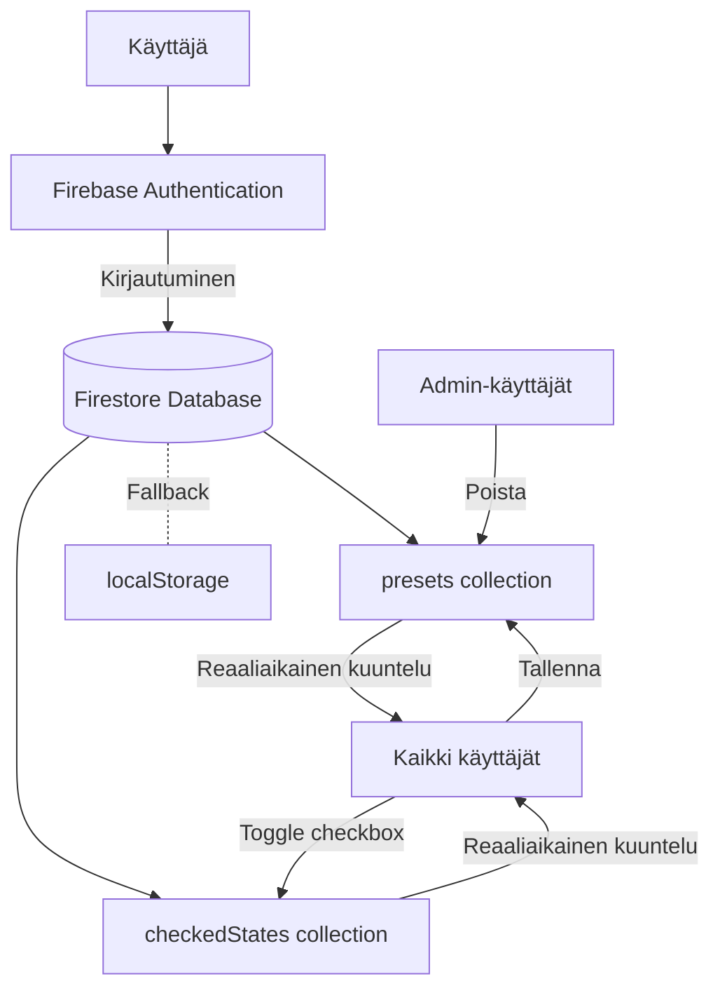

# Firebase Reaaliaikasysteemi - Teräsovi Mittalaskuri

## Arkkitehtuuri




## Toteutuksen vaiheet

### 1. Firebase-projektin konfigurointi

**Ohjeet Firebase-asetusten hankkimiseen:**

- Mene osoitteeseen https://console.firebase.google.com/
- Valitse projektisi tai luo uusi
- Mene Project Settings (rataskuvake) → General
- Scroll alaspäin "Your apps" -osioon
- Valitse "Web app" (</>) ja rekisteröi sovellus nimellä "Teräsovi Mittalaskuri"
- Kopioi Firebase config -objekti (apiKey, authDomain, projectId, storageBucket, messagingSenderId, appId)

**Firestore-tietokannan aktivointi:**

- Firebase Consolessa: Build → Firestore Database → Create database
- Valitse "Start in production mode"
- Valitse sijainniksi europe-west3 (Frankfurt)

**Authentication-metodien aktivointi:**

- Firebase Consolessa: Build → Authentication → Get started
- Sign-in method -välilehti → Email/Password → Enable
- Luo kaksi käyttäjää manuaalisesti:
- `soma@terasovi.local` / `Soma<3` (normaalikäyttäjä)
- `admin@terasovi.local` / `HarriTheMaster` (admin-käyttäjä)

### 2. Firebase SDK:n asennus ja alustus

Luodaan uusi tiedosto [`firebase-config.js`](firebase-config.js) joka sisältää:

- Firebase SDK:n importit (auth, firestore)
- Firebase-projektin konfiguraatio
- Firebase-instanssien alustus
- Admin-käyttäjien lista (admin@terasovi.local)

### 3. Firestore-tietokantarakenne

```javascript
firestore/
├── presets/
│   └── {presetId}/
│       ├── name: string
│       ├── calculator: string
│       ├── mainDoorWidth: number
│       ├── sideDoorWidth: number
│       ├── kickPlateHeight: number
│       ├── settings: object
│       ├── paneHeights: array
│       ├── createdBy: string (user email)
│       ├── createdAt: timestamp
│       └── updatedAt: timestamp
│
└── checkedStates/
    └── global/
        └── checks: {presetId: boolean}
```


### 4. Security Rules

Firestore Security Rules -tiedosto:

```javascript
rules_version = '2';
service cloud.firestore {
  match /databases/{database}/documents {
    // Helper function: onko käyttäjä admin
    function isAdmin() {
      return request.auth != null && 
             request.auth.token.email in ['admin@terasovi.local'];
    }
    
    // Helper function: onko käyttäjä kirjautunut
    function isAuthenticated() {
      return request.auth != null;
    }
    
    // Presets: Kaikki voivat lukea ja luoda, vain admin voi poistaa
    match /presets/{presetId} {
      allow read: if isAuthenticated();
      allow create, update: if isAuthenticated();
      allow delete: if isAdmin();
    }
    
    // CheckedStates: Kaikki kirjautuneet voivat lukea ja kirjoittaa
    match /checkedStates/{document=**} {
      allow read, write: if isAuthenticated();
    }
  }
}
```


### 5. Authentication-järjestelmän päivitys

Muokataan [`app.js`](app.js) kirjautumislogiikka:**Muutokset tiedostossa app.js:**

- Import Firebase config ja auth-funktiot
- Muokataan `loginForm` event listener käyttämään Firebase `signInWithEmailAndPassword()`
- Mapping vanhoista salasanoista Firebase-käyttäjiin:
- "Soma<3" tai "1234" → kirjaudutaan `soma@terasovi.local`
- "HarriTheMaster" tai "4321" → kirjaudutaan `admin@terasovi.local`
- Lisätään `onAuthStateChanged` listener joka tarkistaa kirjautumistilan
- Päivitetään `logout()` käyttämään `signOut()`

### 6. Firestore-integraatio esiasetuksiin

**Päivitetään funktiot käyttämään Firebasea:**

#### `confirmSavePreset()` (rivit 615-645)

- Kerää preset-data kuten ennen
- Tallenna Firestoreen `addDoc(collection(db, 'presets'), presetData)`
- Tallenna myös localStorageen varmuuskopiona
- Lisää error handling: jos Firebase epäonnistuu, käytä vain localStoragea

#### `loadPresetDialog()` ja `refreshPresetList()` (rivit 647-694)

- Hae esiasetukset Firestoresta `getDocs(collection(db, 'presets'))`
- Jos Firebase epäonnistuu, lataa localStoragesta
- Näytä loading-indikaattori haun aikana
- Järjestä esiasetukset luontipäivän mukaan

#### `togglePresetCheck()` (rivit 658-664)

- Päivitä Firestore: `updateDoc(doc(db, 'checkedStates', 'global'), {...})`
- Päivitä myös localStorage
- Optimistinen UI-päivitys (päivitä heti, älä odota Firestore-vastausta)

#### `deletePreset()` (rivit 729-747)

- Tarkista onko käyttäjä admin
- Jos admin: poista Firestoresta `deleteDoc(doc(db, 'presets', presetId))`
- Poista myös localStoragesta
- Jos ei admin: näytä virheilmoitus "Vain admin voi poistaa esiasetuksia"

### 7. Reaaliaikainen kuuntelija

**Lisätään uusi funktio `setupRealtimeListeners()`:**

- Käyttää `onSnapshot()` kuuntelemaan `presets` ja `checkedStates` collectioneita
- Kun muutoksia tapahtuu:
- Päivitä UI automaattisesti kutsumalla `refreshPresetList()`
- Päivitä localStorage varmuuskopiona
- Näytä lyhyt ilmoitus "Esiasetukset päivitetty" (toast notification)
- Kuuntelija aktivoidaan kirjautumisen jälkeen
- Kuuntelija poistetaan uloskirjautumisen yhteydessä

### 8. Offline-tuki ja fallback

**localStorage varmuuskopiona:**

- Jokainen Firestore-operaatio synkronoi myös localStorageen
- Jos Firestore-operaatio epäonnistuu (ei verkkoyhteyttä):
- Käytä localStoragen dataa
- Näytä varoitus "Offline-tila: muutokset eivät synkronoidu"
- Yritä synkronoida kun yhteys palaa

### 9. UI-parannukset

**Lisättävät elementit:**

- Synkronointistatus-indikaattori header-osioon (🟢 Online / 🔴 Offline)
- Toast-ilmoitukset muutosten synkronoinnista
- Loading spinner preset-listan lataamiseen
- "Admin-tila aktiivinen" -badge adminille
- Reaaliaikaisen päivityksen animaatio (highlight uusi/muutettu preset)

### 10. Testaus ja deployment

**GitHub Pages -yhteensopivuus:**

- Firebase toimii täysin client-sidella, ei tarvetta backend-palvelimelle
- Kaikki Firebase-konfiguraatio voidaan sisällyttää staattisiin tiedostoihin
- HTTPS toimii automaattisesti GitHub Pagesissa (vaaditaan Firebaselle)

**Päivitettävät tiedostot:**

- [`index.html`](index.html): Lisää Firebase SDK script-tagit
- [`app.js`](app.js): Kaikki edellä mainitut muutokset
- [`styles.css`](styles.css): Synkronointistatuksen ja toast-ilmoitusten tyylit
- Uusi: `firebase-config.js`

## Tiedostomuutokset

### Muokattavat tiedostot:

1. **index.html** - Firebase SDK script-tagit, synkronointistatus-elementti
2. **app.js** - Authentication, Firestore-integraatio, reaaliaikainen kuuntelu
3. **styles.css** - Synkronointistatuksen ja toast-ilmoitusten tyylit

### Uudet tiedostot:

1. **firebase-config.js** - Firebase-konfiguraatio ja alustus

## Turvallisuus

- Firebase API-avain voidaan julkaista turvallisesti (se on tarkoitettu julkiseksi)
- Turvallisuus perustuu Firestore Security Rulesiin
- Admin-oikeudet tarkistetaan sekä client-puolella (UX) että server-puolella (Security Rules)
- Kaikki salasanat tallennetaan Firebaseen hashattuina automaattisesti

## Yhteenveto

Tämä toteutus mahdollistaa:

- ✅ Reaaliaikainen synkronointi kaikkien käyttäjien välillä
- ✅ Firebase Authentication turvalliseen kirjautumiseen
- ✅ Admin-käyttäjät voivat poistaa esiasetuksia
- ✅ localStorage varmuuskopiona offline-tilassa