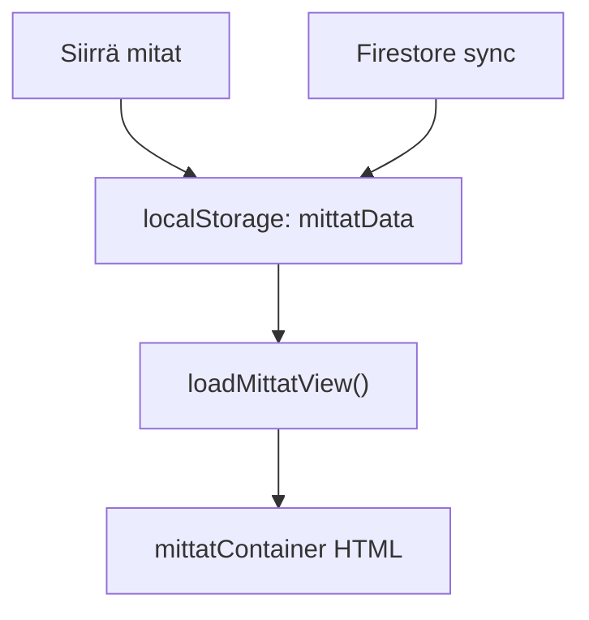
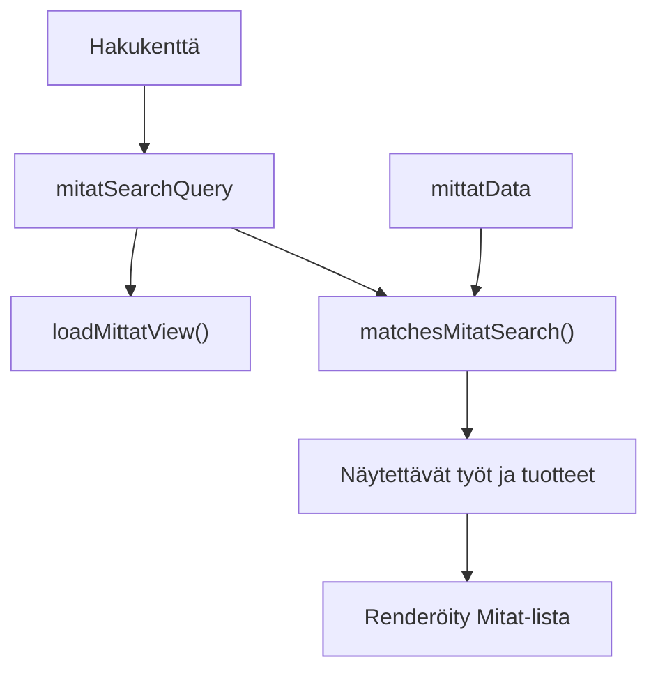

# Mitat-sivun Hakukenttä

## Tavoite

Lisätään `Mitat`-sivulle yksi selkeä hakukenttä, jolla käyttäjä voi suodattaa näkyviä töitä ja tuotteita esimerkiksi työnumerolla, tuotteen nimellä, tuotetyypillä (`ovi`, `ikkuna`) sekä lasilistan värillä kuten `RAL 9010`.

## Muutettavat tiedostot

- [C:/Users/Harri/.cursor/index.html](C:/Users/Harri/.cursor/index.html)
  - Lisätään hakukenttä `Mitat`-otsikon alle tai otsikkorivin yhteyteen ennen `mittatContainer`-elementtiä.
  - Kentän placeholder voisi olla: `Hae työnumerolla, tuotteella, värillä...`

- [C:/Users/Harri/.cursor/app.js](C:/Users/Harri/.cursor/app.js)
  - Lisätään hakusanan käsittely, esimerkiksi `handleMitatSearchInput()`.
  - Päivitetään `loadMittatView()` suodattamaan `mittatData` ennen HTML:n rakentamista.
  - Säilytetään nykyiset toiminnot: piilotetut tuotteet, pakkausluettelo-tila, lasilistojen PDF-tila, checkpointit, muistiinpanot, poisto, kopiointi ja PDF.

- [C:/Users/Harri/.cursor/styles.css](C:/Users/Harri/.cursor/styles.css)
  - Lisätään tarvittaessa pieni tyyli hakukentälle, jotta se sopii nykyiseen kortti-/Bootstrap-ulkoasuun.

## Nykyinen datavirta

## Uusi hakulogiikka

## Hakukriteerit

Haku kannattaa tehdä yhdellä normalisoidulla tekstivertailulla. Hakusana ja haettava data muutetaan pieniksi kirjaimiksi, ylimääräiset välilyönnit poistetaan, ja `RAL 9010` toimii samalla tavalla riippumatta kirjoittaako käyttäjä `ral 9010` tai `RAL 9010`.

Osumaksi lasketaan tuote, jos hakusana löytyy jostain näistä:

- työnumero, esimerkiksi `12345`
- tuotteen nimi, esimerkiksi `X5`, `ovi 1`, `ikkuna A`
- laskurityyppi `item.calculator`, esimerkiksi `janisol-ikkuna`
- laskurityypistä johdettu yleissana, esimerkiksi `ikkuna` tai `ovi`
- lasilistan väri `item.lasilistaColor`, esimerkiksi `RAL 9010`
- lasilistan koko `item.lasilistaSize`, esimerkiksi `15mm`
- tarvittaessa mittarivien otsikot/arvot `item.data`, jos halutaan laajempi haku

## Toteutustapa

1. Lisätään `index.html`:ään hakukenttä `Mitat`-näkymään ennen `mittatContainer`ia.
2. Lisätään `app.js`:ään globaali hakusana, esimerkiksi `let mitatSearchQuery = '';`.
3. Lisätään funktio, joka lukee kentän arvon ja kutsuu `loadMittatView()` uudelleen.
4. Lisätään apufunktio `matchesMitatSearch(jobNumber, itemName, item)`, joka palauttaa `true`, jos tuote vastaa hakua.
5. Päivitetään `loadMittatView()` käyttämään nykyisen `visibleItemNames`-listan lisäksi hakusuodatusta.
6. Jos työssä ei ole yhtään hakutulosta, koko työ piilotetaan haun aikana.
7. Jos haku ei löydä mitään, näytetään selkeä teksti: `Ei hakutuloksia.`
8. Kun hakukenttä tyhjennetään, nykyinen koko `Mitat`-lista palaa näkyviin.

## Rajaukset

- Ei muuteta `mittatData`-rakennetta eikä Firestore-synkronointia.
- Ei lisätä erillistä hakutietokantaa tai indeksiä, koska nykyinen datamäärä näyttää sopivan hyvin suoraan selaimessa suodatettavaksi.
- Ei muuteta `Paketit`-sivun toimintaa tässä vaiheessa.
- Ensimmäisessä versiossa ei tarvitse korostaa hakutermiä tuloksissa; se voidaan lisätä myöhemmin, jos käyttäjä kaipaa sitä.

## Verifiointi

- Hae työnumerolla ja varmista, että vain vastaava työ näkyy.
- Hae tuotteen nimellä ja varmista, että vain vastaavat tuotteet näkyvät.
- Hae `ikkuna` ja varmista, että ikkunalaskureilla tallennetut tuotteet löytyvät.
- Hae `ovi` ja varmista, että ovilaskureilla tallennetut tuotteet löytyvät.
- Hae `RAL 9010` ja varmista, että kyseisen värin tuotteet löytyvät.
- Tyhjennä haku ja varmista, että koko lista palautuu.
- Tarkista, että pakkausluettelo-, lasilistat PDF-, piilotetut tuotteet-, checkpoint- ja muistiinpanotoiminnot toimivat edelleen.